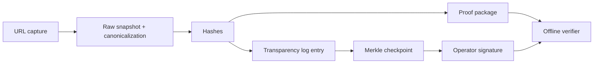

# Auth Layer MVP

An authenticity and provenance MVP for capturing a URL, preserving the fetched state, extracting deterministic canonical content, hashing a proof bundle, and issuing timestamp and transparency receipts.

## Workspace layout

- `packages/shared`: public protocol types shared between the API, worker, CLI, and web app
- `packages/core`: capture pipeline, repositories, storage adapters, migrations, timestamping, transparency log support, proof-package export, verification logic, and capture comparison services
- `apps/api`: Express API
- `apps/worker`: polling worker for queued captures
- `apps/web`: React SPA for submitting captures, browsing results, and comparing observed captures over time

## Development

1. Install dependencies with `npm install`.
2. Copy `.env.example` to `.env` and set `DATABASE_URL`.
3. Optionally configure operator keys in `.env` using `OPERATOR_PRIVATE_KEY_PEM` or `OPERATOR_PRIVATE_KEY_PATH`.
4. Optionally configure `RENDER_BROWSER_PATH` to enable rendered screenshot evidence for web captures.
5. Run `npm run db:migrate` to apply the Postgres schema.
6. Run `npm run dev` for the API and web app.
7. Run `npm run dev:worker` separately only if you disable the embedded development worker.

Postgres is the primary datastore for capture facts, proof bundles, receipts, and append-only evidence history. Large artifacts remain in object storage under `ARTIFACT_STORAGE_DIR`, which defaults to `.data/artifacts` for local development.

## Protocol vs implementation

This repo aims to be a reference implementation of a portable proof format, not the only place proofs can be checked. The durable pieces are:
- deterministic canonicalization and hashing rules
- exported proof packages
- signed transparency checkpoints
- trusted operator public keys
- offline verification of checkpoint signatures and Merkle inclusion proofs

## Evidence layers

Each capture can preserve several evidence layers. They are related, but they are not interchangeable:
- `Raw snapshot`: proves what the operator fetched or ingested at capture time. It is hashed and exported as raw artifacts. It does not prove what the publisher created before capture.
- `Canonical content`: proves the deterministic semantic extraction used for comparison. It is hashed separately so cosmetic HTML churn does not automatically count as a content change. It does not prove publisher intent or truth.
- `Metadata`: proves the normalized citation-like fields extracted from the artifact, such as title, author, and claimed published date. It does not independently validate those claims.
- `Rendered evidence`: proves what the operator-rendered page looked like under the recorded viewport and device settings when a screenshot was captured. It supports human inspection, not semantic equality, and screenshot equality across captures is neither expected nor required.

## Architecture



## Proof packages

Export a portable proof package for a capture:

```bash
npm run proof:export -- <capture-id> <output-directory>
```

Verify a package offline with a trusted operator key and published checkpoint:

```bash
npm run proof:verify -- <package-directory> --checkpoint <checkpoint.json> --operator-key <operator-public-key.json>
```

The verifier recomputes hashes from exported artifacts. If `TIMESTAMP_SECRET` is available locally, it also verifies the internal timestamp receipt signature. Verification proceeds in this order:
1. proof package integrity
2. Merkle inclusion proof
3. signed checkpoint against a trusted operator key
4. optional PDF approval receipt

## Transparency checkpoints

Export the latest checkpoint:

```bash
npm run transparency:checkpoint -- [output-path]
```

Export the current operator public key:

```bash
npm run transparency:operator-key -- [output-path]
```

The current transparency model uses signed Merkle checkpoints. Checkpoints attest to log size and Merkle root, and proof packages include an inclusion proof that can be verified offline. Older exact-entry hash-chain checkpoints are treated as legacy and remain supported only for backwards compatibility.

The API exposes:
- `POST /api/captures`
- `POST /api/pdfs`
- `GET /api/captures/:id/export`
- `GET /api/transparency/log/captures/:id`
- `GET /api/transparency/checkpoints/latest`
- `GET /api/transparency/operator-key`
- `GET /api/urls/:encodedUrl/captures`
- `GET /api/urls/:encodedUrl/compare`
- `POST /api/watchlists`
- `GET /api/watchlists`
- `PATCH /api/watchlists/:id`
- `POST /api/watchlists/:id/retry`
- `GET /api/watchlists/:id/runs`
- `POST /api/watchlists/:id/test-webhook`

## Comparison UX

The UI and API can compare two observed captures of the same normalized URL by capture ID or capture timestamp. Comparisons report:
- canonical content hash changes
- metadata hash changes
- title/author/claimed publish date changes
- page kind and extractor version changes
- block-level paragraph additions/removals and heading changes
- extraction diagnostics and drift notes

These comparisons describe differences between two observed captures. They do not claim original publisher intent or creation time.

## Example artifacts

Generate example proof packages and broken fixtures:

```bash
npm run examples:generate
```

This writes `examples/` with:
- a valid proof package with a Merkle inclusion proof
- tampered packages, including a broken inclusion proof
- a valid checkpoint and a mismatched checkpoint
- a trusted operator public key and a wrong operator key

## Documentation

Protocol and trust docs:
- `docs/trust-model.md`
- `docs/proof-package-spec.md`
- `docs/transparency-log.md`
- `docs/threat-model.md`
- `docs/verification-guarantees.md`
- `docs/multi-operator-roadmap.md`

## Watchlists

Watchlists are local-first monitoring jobs backed by Postgres and the existing worker. Each due run creates a normal capture, compares the latest successful capture to the previous successful capture for the same normalized URL, and records optional local/webhook/JSON notification deliveries. The UI surfaces latest run verdicts, capture health, last capture timing, last detected change timing, last successful checkpoints, retry-now controls, and run-level delivery summaries without creating a second evidence model.

## Rendered evidence and PDF support

Web captures can now optionally preserve rendered evidence when a local browser executable is configured. Today that means a screenshot plus explicit render settings such as viewport width and height, pixel ratio, device preset, screenshot format, and user-agent information. The screenshot is stored as its own artifact with its own hash, exported in proof packages, and verified offline against that hash. It strengthens visual inspection, but it is not canonical content and is not used as the semantic diff input.

The MVP also supports standalone PDF file proof generation. Uploaded PDF files are preserved as raw artifacts, normalized into deterministic metadata and text outputs where available, bundled into the same proof-package format, and verified offline with the same Merkle checkpoint flow used for URL captures. PDF uploads can also carry an upload-time approval receipt that records which uploader account approved the exact file hash. That approval is additive provenance: operator observation remains sufficient for capture verification even when no uploader approval is present. PDF captures now also surface conservative quality signals such as embedded-text detection, extracted character count, metadata extraction, and a cautious likely-scanned heuristic.

## Operator quickstart

See `docs/operator-quickstart.md` for a minimal self-hosted operator setup and offline verification flow.
